# DHealth-Block

Decentralised Health Block — an Android app that stores patient/doctor medical history on an Ethereum smart contract, with Firebase for auth and off-chain metadata.

> 2021 final-year-style college blockchain project, originally built for [Hack36](https://hack36.com) by team "Against Gravity": [Ashutosh Kumar](https://github.com/waytoashutosh), [Gidijala Uday Srinu](https://github.com/udaysrinu), [Ashwini Pal](https://github.com/ashwiniswag).
>
> This is **not a from-scratch blockchain in Java**. It is an Android dApp that talks to a single Solidity contract (`D_Health_Block`) on a public EVM chain (Matic / Ethereum testnet) via Web3J. The "block" in the name refers to the contract, not a hand-rolled chain.

## What it does

Patients and doctors register through an Android app. Their identities live in Firebase Auth; their profiles live in Firebase Realtime Database; their **medical history** lives on-chain in a Solidity contract.

- A **patient** is registered with `(name, aadhaar, wallet address)` and assigned a sequential `pID` by the contract.
- A **doctor** is registered with `(license, name, hospital)` and keyed by their license number.
- When a doctor begins a treatment, the app calls `addPatientData(...)`, which appends a `patientData` record (doc name, hospital, license, date, disease) to **two** on-chain lists: `pDataList[patientId]` and `dDataList[license]`. Either side can later fetch their full history with `getPatientData` / `getDoctorData`.
- Aadhaar and license uniqueness are enforced by `adharExists` / `licenseExists` mappings.

The deployed contract address is recorded in [`Contracts/address.txt`](./Contracts/address.txt):
`0x4fb7f07431Adc149651feF059a99f1326b023341` (deployer `0xC2e44...1bfA`).

#### Original data flow diagram (from authors)


#### Demo

- [Demo video](https://youtu.be/klDg0ZmR-rc)
- [Slide deck](https://docs.google.com/presentation/d/1hDrJ4dDie20ds_RUNivez1sBMxraHswHCpkc3Ex4CMg/edit?usp=sharing)

## Architecture



Three layers:

1. **Android app** (`app/src/main/java/com/example/dhealth_block/` and `.../doctorarea/`) — Java activities and fragments for login, patient dashboard, doctor dashboard, appointments, treatments, and medical history.
2. **Web3J bridge** (`com.example.contracts.Testcontract`) — generated from `testcontract.abi` + `testcontract.bin` using the Web3J CLI. Wraps the Solidity functions as native Java calls.
3. **Solidity contract** ([`Contracts/TestContract.sol`](./Contracts/TestContract.sol)) — `D_Health_Block`, the on-chain source of truth.

Firebase sits beside this for two roles: **Auth** (sessions, password reset) and **Realtime DB** (profile fields, appointment lists, anything not worth paying gas to store). Wallet keys are bring-your-own — the app expects an `account_address` per patient.

## Block / contract structure

The contract has no chain, blocks, mining, or consensus of its own — it relies on the underlying EVM for that. The on-chain state is:

```solidity
contract D_Health_Block {
    uint256 pID = 0;                                    // monotonic patient ID

    struct patient     { uint256 id; string name; uint256 adhar; address account_address; }
    struct doctor      { uint256 license; string name; string hospital; }
    struct patientData { uint256 patient_id; string name_of_doc; string hospital;
                         uint256 license; uint256 date; string disease; }

    mapping(uint256 => patient)         public pMap;        // pID  -> patient
    mapping(uint256 => doctor)          public dMap;        // lic  -> doctor
    mapping(uint256 => patientData[])   public pDataList;   // pID  -> history
    mapping(uint256 => patientData[])   public dDataList;   // lic  -> history
    mapping(uint256 => bool)            licenseExists;
    mapping(uint256 => bool)            adharExists;
}
```

Public entrypoints: `createPatient`, `updatePatient`, `createDoctor`, `updateDoctor`, `addPatientData`, `getPatientData`, `getDoctorData`.

## Consensus mechanism

There is no custom consensus. The app delegates consensus, ordering, and finality to the **underlying EVM chain** (the deployed address suggests Polygon / Matic Mumbai testnet, consistent with the `Matic` entry in the original tech stack). State changes happen via standard `eth_sendRawTransaction` from Web3J; reads use `eth_call`.

## Tech stack

- **Android**: `compileSdk 30`, `minSdk 21`, Java 8, Gradle 4.1.3
- **Blockchain client**: `org.web3j:core:4.6.0-android`
- **Contract**: Solidity `^0.8.3`, deployed to a public EVM chain (Matic Mumbai / Ethereum testnet)
- **Auth + off-chain storage**: Firebase Auth + Firebase Realtime Database (`firebase-bom:26.8.0`)
- **Misc**: Material Components, Navigation component, Play Services Location, `circularimageview`

## How to run

> Disclaimer: this code is from 2021. Gradle 4.x, jcenter, and SDK 30 are all sunset; expect to upgrade dependencies to build on a modern machine.

1. **Prereqs**: JDK 8, Android Studio Arctic Fox era, an Android device or emulator (API 21+).
2. **Wallet + RPC**: you need access to the same EVM testnet the contract was deployed on. Either:
   - Re-deploy `Contracts/TestContract.sol` to your own testnet (Remix → Mumbai) and update the contract address in `Testcontract.java`, **or**
   - Point Web3J at a node that still has the original contract at `0x4fb7...3341` (unlikely on Mumbai today, since old testnets get reset).
3. **Firebase**: replace `app/google-services.json` with your own project's config and enable Email/Password auth + Realtime Database.
4. **Build & run**: `./gradlew :app:installDebug`, then launch on the device. Register as a patient or doctor.

## What I'd do differently today

- **Don't put PII on a public chain.** Aadhaar numbers, names, and disease strings stored unencrypted in `pDataList` / `dDataList` are visible to anyone. Store only **hashes / pointers** on-chain and keep the actual records in encrypted off-chain storage (IPFS + per-patient envelope encryption, or a permissioned DB).
- **Use Hyperledger Fabric or a permissioned chain.** Healthcare needs identifiable, auditable participants — public Ethereum is the wrong substrate. A permissioned chain with channel-based privacy fits the trust model far better.
- **Proper key management.** Hardware-backed Android Keystore (StrongBox) for signing keys, with WebAuthn / passkey-style flows. Right now the app assumes the patient already has a wallet and address.
- **Role-based access at the contract level**, not in the UI. Use OpenZeppelin `AccessControl` so a patient can grant/revoke read access to a specific doctor; today any caller can read any patient's history via `getPatientData`.
- **Event-driven reads.** Replace the `for` loops that allocate five parallel arrays with indexed events + The Graph subgraph. The current pattern will hit gas limits as histories grow.
- **Modern stack**: Kotlin + Jetpack Compose + Hilt, Web3J 5.x or Kotlin/JS bindings, Material 3, AGP 8, Gradle 8, Firebase BoM 33+.
- **Tests.** There is one auto-generated `ExampleUnitTest`. Add Solidity tests (Foundry / Hardhat) and Robolectric tests for the activities.

## Limitations

Honest caveats — this is a hackathon-grade project, not production:

- **Privacy**: medical records and Aadhaar numbers are written to a public EVM chain. Anyone with the contract address can call `getPatientData` for any `pID`.
- **Authorization**: the contract doesn't restrict callers. Any address can register a patient, register a doctor, or append `patientData` to anyone's record. There is no `onlyDoctor` modifier, no signature check that the doctor actually saw the patient.
- **Bug in `createPatient`**: `adharExists[_adhar]==true;` is a comparison, not an assignment (should be `=`, not `==`). Aadhaar uniqueness is therefore not actually enforced.
- **Bug in `getDoctorData`**: gates on `licenseExists[_license]==true`, but `licenseExists` is also flipped to `true` in `addPatientData` even when the doctor never registered — so the existence check is unreliable.
- **Gas**: the parallel-array return pattern in `getPatientData` / `getDoctorData` allocates 5 arrays per call and loops over the whole history. Fine for a demo, ugly at scale.
- **Centralisation in disguise**: Firebase Auth + Firebase Realtime DB is a single Google-controlled point of failure. Calling the system "decentralised" is a stretch when the login layer is fully centralised.
- **51% / small-network attacks**: not directly relevant since the project rides on a public EVM, but if you redeploy on a private chain with few validators this becomes a real concern.
- **No data deletion / GDPR**: by design — chain data is immutable. Real-world health records have a right-to-be-forgotten requirement.

## License

Not specified in the repo. Treat as personal / educational code from a college hackathon.
